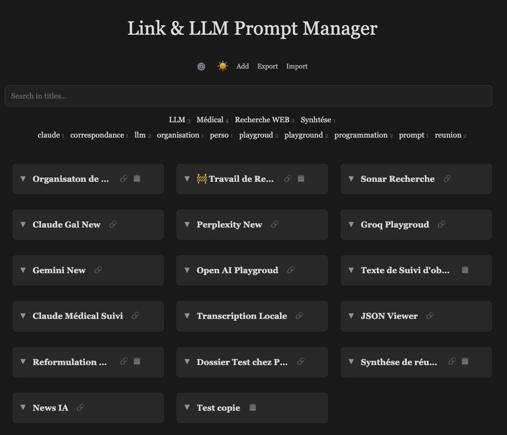

# Link & LLM Prompt Manager

A lightweight web application for organizing and managing LLM prompts, links, and text snippets with dynamic placeholders.

## Features

- Create and manage cards containing titles, links, and LLM prompts
- Dynamic placeholder system (date/time, clipboard content)
- One-click copy of prompt text to clipboard
- One-click opening of associated links
- Search and filter by tags or text content
- Export and import data in JSON format
- Light/dark theme
- Minimalist and intuitive interface

## Overview


*Main interface showing organized cards with their tags and search options*

## Use Cases

- **LLM Prompt Management**: Store and organize prompts for different AI models
- **Research Organization**: Group links by research topics or projects
- **Quick Access**: Instantly access frequently used resources
- **Dynamic Content**: Use placeholders for dynamic content in your prompts

## Technologies

- HTML5
- CSS3
- JavaScript (Vanilla)
- Marked.js for Markdown rendering

## Installation

No installation required. Simply clone this repository and open the `index.html` file in a web browser.

```bash
git clone https://github.com/your-username/link-llm-prompt-manager.git
cd link-llm-prompt-manager
```

## Usage

1. Click "+" to add a new card
2. Give your card a title
3. Add links or prompt text with optional placeholders
4. Use tags to organize your cards
5. Click on a card title to copy its content or open its links
6. Use the search bar to filter cards by title or tags

## Placeholder System

The application supports dynamic placeholders that are replaced when copying text:

- `{YYYY-MM-DD_HH-mm-SS}`: Current date and time in the format YYYY-MM-DD_HH-mm-SS
- `{clipboard}`: Current clipboard content

## Backup and Export

All data is automatically saved in your browser's local storage. You can also export your data to a JSON file for backup or sharing.

## Contributing

Contributions are welcome! Feel free to submit pull requests or suggest new features, especially additional placeholders.

## License

This project is licensed under the MIT License.
